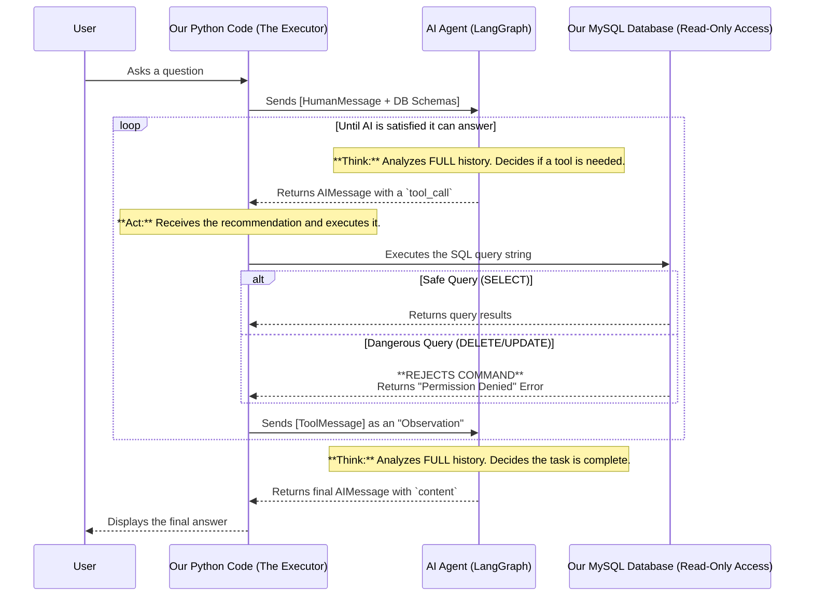

---

## How Our AI Agent Securely Interacts with the Database

### Executive Summary: The AI is a Sandboxed Analyst, Not a Database Admin

The most important thing to understand is that the AI **does not have direct access to our database.**

A perfect analogy is to think of the AI as a talented but junior data analyst who is working remotely.
- We give this analyst a document describing our database tables (the schemas).
- We ask the analyst a question.
- The analyst reads the document and writes down a SQL query on a piece of paper, suggesting how they would answer the question.
- They hand that piece of paper back to **our internal, trusted code.**
- Our code looks at the suggestion, and only then does it use our own secure, **read-only** key to run the query.

The AI never touches our database. It only suggests a query, and our own code is the gatekeeper that executes it under strict, safe permissions.

### The Core Principle: A Clear Separation of Roles

Our system is built on a fundamental security principle: the separation of the **Recommender** (the AI) and the **Executor** (our Python code).

| Role | The AI Agent (The Recommender) | Our Python Code (The Executor) |
| :--- | :--- | :--- |
| **What it Sees** | Only text: the user's question, the table schemas, and the full conversation history. | The AI's recommendation (`tool_call`), our database credentials, and all our tools. |
| **What it Does** | Generates a **string of text** that looks like a SQL query. | **Executes** the SQL string against the database using a secure, read-only connection. |
| **Permissions** | Has **zero** database permissions. It cannot connect to anything. | Has **read-only (`SELECT`)** permissions, granted by our database administrator. |
| **Analogy** | The junior analyst writing a query on paper. | The senior developer who takes the paper and runs the query safely. |

---

### In-Depth Walkthrough: How a Query is Processed

Let's trace a user's question from start to finish to see this separation in action.

#### Scenario 1: A Simple, Single-Step Question

**User asks:** "How many tickets have been created in total?"

1.  **Our Code to AI:** Sends the user's question and database schemas to the AI.
2.  **AI Thinks (Recommendation 1):** Analyzes the request and generates a `tool_call` to count the rows in `tbl_ticket_create`.
3.  **Our Code Acts (Execution 1):** Receives the `tool_call` and safely executes the `SELECT COUNT(*)` query.
4.  **Database Responds:** The database returns the result: `[(5772,)]`.
5.  **Our Code to AI:** Sends this result back to the AI in a `ToolMessage` as an "Observation."
6.  **AI Thinks & Formulates Final Answer:** The AI reviews the *entire history* (the original question and the tool result). It sees that `[(5772,)]` is a complete answer to the question and decides the task is finished. It generates the final, human-readable response:
    > "There have been 5772 tickets created in total."

#### Scenario 2: A Complex, Multi-Step Question

This scenario highlights the iterative power you mentioned.

**User asks:** "Which department has the most open tickets?"

1.  **Our Code to AI:** Sends the question and schemas to the AI.
2.  **AI Thinks (Recommendation 1):** The AI reasons, "To answer this, I first need a list of all departments." It generates its first `tool_call`:
    ```json
    { "args": {"query": "SELECT DEPARTMENT_ID, DEPARTMENT_NAME FROM tbl_m_department;"} }
    ```
3.  **Our Code Acts (Execution 1):** Our code executes this query.
4.  **Database Responds:** The database returns a list of departments: `[(1, 'IT'), (2, 'HR')]`.
5.  **Our Code to AI:** Sends this list back in a `ToolMessage`.
6.  **AI Thinks Again (Recommendation 2):** The AI now reviews the *entire history*: the original question ("who has the most open tickets?") and the list of departments it just received. It thinks, "Okay, I have the departments, but I don't have the ticket counts yet. Now I need to count the open tickets for the 'IT' department." It generates a **second** `tool_call`:
    ```json
    { "args": {"query": "SELECT COUNT(*) FROM tbl_ticket_create WHERE DEPARTMENT_ID = 1 AND ACTION_ID = 1;"} }
    ```
7.  **Our Code Acts (Execution 2):** Our code executes this second, different query.
8.  **Database Responds:** The database returns the count for IT: `[(42,)]`.
9.  **AI Continues this Loop...** The agent will continue this process for every department until it has gathered all the necessary data.
10. **AI Thinks & Formulates Final Answer:** Once it has all the counts, it reviews the full history and determines it can finally answer the original question. It generates the final response:
    > "The 'IT' department has the most open tickets with a total of 42."

---

### The Power of Iteration and Self-Correction

This multi-step capability is central to the agent's intelligence. Because it reviews the **entire conversation history** on every turn, it can:
*   **Solve Complex Problems:** Break down a big question into smaller, manageable steps.
*   **Correct its Course:** If a query returns an error or unexpected data, it can see its mistake and try a different query in the next step.
*   **Ensure Completeness:** It won't stop until it is satisfied that the data it has gathered is sufficient to fully answer the user's original request.

### System Flow Diagram (Updated with Iterative Loop)

This diagram shows the complete flow, including the agent's ability to loop through multiple tool calls until it's satisfied.



### Final Security Guarantees

*   **The AI is Sandboxed:** It lives entirely within the LangGraph framework and can only process and generate text.
*   **Our Code is the Gatekeeper:** No database query—whether it's the first or the fifth in a loop—is ever run until our own Python code explicitly executes it.
*   **Database Permissions are the Ultimate Safety Net:** Our system is designed to use a database user with the absolute minimum required permissions (read-only). Even if a flaw existed in our code, the database itself provides the final, unbreakable line of defense.